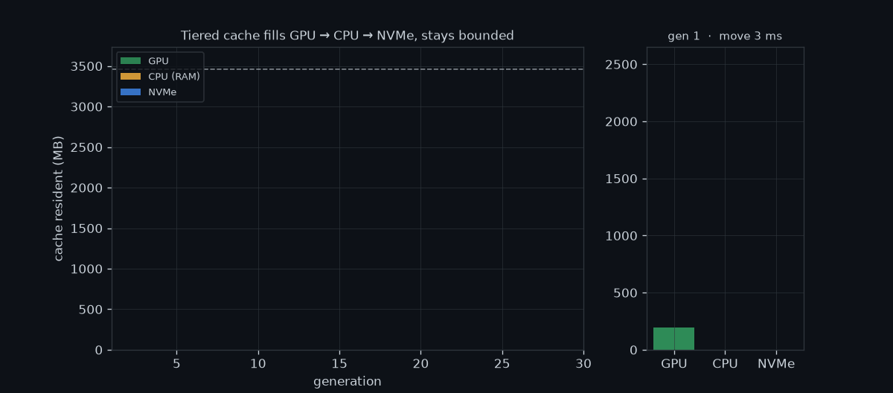
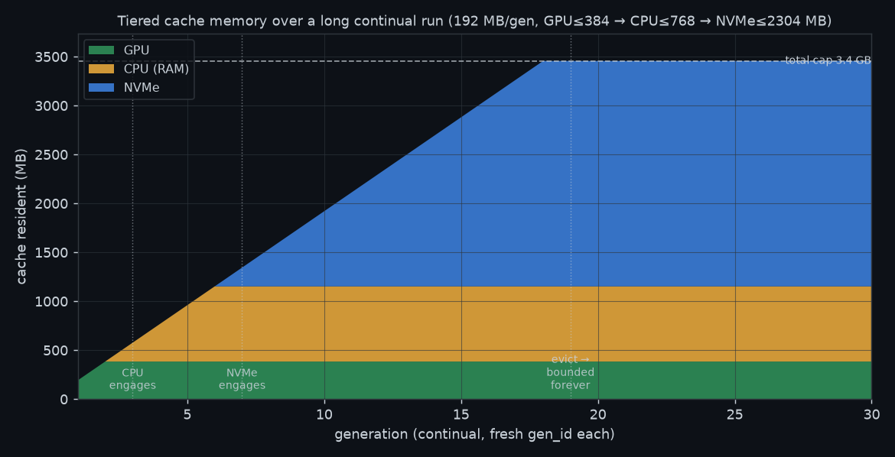
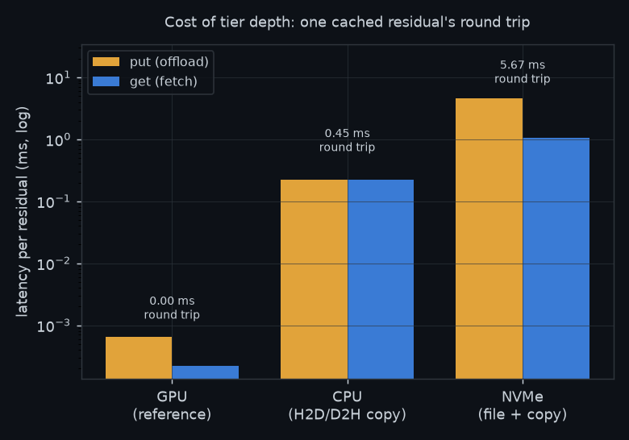

<div align="center">

<picture>
  <source media="(prefers-color-scheme: dark)" srcset="./assets/edit-logo-dark.png" />
  
</picture>

### A Lightweight, Editable Inference Engine for Diffusion Transformers (DiTs)

<p>
  <a href="#install">📦 Install</a> &nbsp;·&nbsp;
  <a href="#quick-start">🚀 Quick Start</a> &nbsp;·&nbsp;
  <a href="#benchmark">📊 Benchmark</a> &nbsp;·&nbsp;
  <a href="#how-it-works">🧩 How It Works</a> &nbsp;·&nbsp;
  <a href="#custom-cache-policies">🧪 Custom Policies</a> &nbsp;·&nbsp;
  <a href="#acknowledgements">🙏 Acknowledgements</a>
</p>

<p>
  <a href="https://github.com/Antlera/EDiT/blob/edit/LICENSE"></a>
  
  
</p>

</div>

**EDiT** is a lightweight, hackable inference engine for diffusion transformers, built around **editable cache storage**. It treats the denoising process as a flow you can inspect and modify — steps, CFG branches, block groups, residuals, and cache decisions are all exposed as first-class pieces of the pipeline.

The first target is single-GPU Wan text-to-video: the code leans on [diffusers](https://github.com/huggingface/diffusers) components where they are useful, but keeps the denoising loop explicit. That makes it easy to study *how* a cache policy changes a generation, not just how much faster it runs — and gives new models and policies a clean surface to plug into.

<a id="updates"></a>

## 📢 Updates

- **[2026-06]** Tiered cache (GPU → CPU → NVMe) with **async prefetch** and **cross-segment reuse** — [bounded-VRAM long-video generation](#prefetch-reuse) whose swap-in overlaps compute.
- **[2026-06]** Pluggable cache-policy framework: choose a **policy** (when to skip), a **granularity** (stack / per-block / grouped), and a **store** (GPU / CPU-offload / disk) independently.
- **[2026-06]** Initial release — single-GPU Wan2.1 text-to-video with TeaCache and First-Block-Cache, and bit-for-bit parity with the no-cache path.

<a id="highlights"></a>

## ✨ Highlights

- 🎬 **Single-GPU Wan T2V** inference on top of diffusers components.
- ⏭️ **Step-skipping policies** — TeaCache and First-Block-Cache out of the box.
- 🧱 **Editable cache storage** at stack-level, per-block, or grouped-block granularity.
- ♾️ **Tiered cache (GPU → CPU → NVMe)** with per-tier budgets + LRU spill — [continual generation that never OOMs](#run-forever).
- 🎞️ **Async prefetch + cross-segment reuse** — [long-video swap-in overlaps compute](#prefetch-reuse), so bounded-VRAM runs stay near in-VRAM speed.
- 🔍 **Explicit denoising loop** with callback hooks and live cache statistics.
- 🎯 **Bit-for-bit parity** with the no-cache path when skipping is disabled.

<a id="install"></a>

## 📦 Install

We recommend [uv](https://github.com/astral-sh/uv):

```bash
uv pip install git+https://github.com/Antlera/EDiT.git
```

Or from a local clone for development:

```bash
git clone https://github.com/Antlera/EDiT.git
cd EDiT
uv pip install -e .
```

<details>
<summary>Using plain pip instead</summary>

```bash
pip install git+https://github.com/Antlera/EDiT.git
```

</details>

<a id="quick-start"></a>

## 🚀 Quick Start

`EditWanPipeline` follows the shape of diffusers' `WanPipeline`. Caching is enabled with one extra call:

```python
import torch
from edit import EditWanPipeline

pipe = EditWanPipeline.from_pretrained(
    "Wan-AI/Wan2.1-T2V-1.3B-Diffusers",
    torch_dtype=torch.bfloat16,
    device="cuda",
)

pipe.enable_cache(
    policy="teacache",      # "teacache", "fbcache", or a registered policy
    num_inference_steps=30,
    rel_l1_thresh=0.2,      # higher is faster; lower preserves more fidelity
    wan_variant="t2v-1.3B", # official Wan2.1 TeaCache coefficients
)

video = pipe(
    prompt="A cat and a dog baking a cake together in a kitchen.",
    negative_prompt="blurry, low quality",
    height=480,
    width=832,
    num_frames=33,
    num_inference_steps=30,
    guidance_scale=5.0,
)[0]

print(pipe.cache.stats)
```

Skip `enable_cache(...)` to run the baseline path.

<a id="benchmark"></a>

## 📊 Benchmark

Cached vs. uncached Wan2.1-T2V-1.3B runs on a single GPU. See [bench.py](bench.py) for the script.

<details>
<summary><b>Configuration</b></summary>

- **Hardware:** 1× NVIDIA RTX PRO 6000 Blackwell
- **Model:** Wan2.1-T2V-1.3B, bf16
- **Output:** 480×832, 33 frames
- **Sampling:** 30 steps, CFG 5.0, UniPC with `flow_shift=3.0`
- **Prompt and seed:** fixed across runs

</details>

| Configuration | Time | Speedup | Steps skipped | Peak VRAM |
| --- | ---: | ---: | ---: | ---: |
| No cache | 28.6 s | 1.00× | 0% | 15.5 GB |
| TeaCache, `rel_l1_thresh=0.1` | 18.3 s | **1.57×** | 37% | 15.6 GB |
| TeaCache, `rel_l1_thresh=0.2` | 12.7 s | **2.26×** | 57% | 15.6 GB |
| TeaCache, `rel_l1_thresh=0.3` | 9.8 s | **2.90×** | 67% | 15.6 GB |

> Skipped steps still run the non-block work around the transformer stack — patch embedding, RoPE, conditioning, output normalization, and unpatchifying. Here that fixed work is about **17%** of a full transformer forward, which bounds the practical speedup.

<a id="run-forever"></a>

### ♾️ Run forever: tiered cache storage (GPU → CPU → NVMe)

The feature cache lives behind a pluggable [`CacheStore`](edit/cache/store.py). A `TieredStore` cascades **GPU → CPU (RAM) → NVMe** by a per-tier byte budget: new residuals land on the GPU, and when a tier is over budget its least-recently-used entries *spill down* to the next tier. Bound every tier and the **total footprint is fixed forever** — the oldest generations are evicted (and safely recomputed on demand), so a continual run never OOMs.

<p align="center">
  
</p>

A long continual run (fresh `gen_id` each generation, **192 MB of fresh cache per generation**, tiers bounded at GPU ≤ 384 MB → CPU ≤ 768 MB → NVMe ≤ 2304 MB):

<p align="center">
  
  
</p>

| Gen | GPU MB | CPU MB | NVMe MB | Total | Move ms/gen |
| ---: | ---: | ---: | ---: | ---: | ---: |
| 2 | 384 | 0 | 0 | 384 | ~1 |
| 4 | 384 | 384 | 0 | 768 | ~95 |
| 7 | 384 | 768 | 192 | 1344 | ~80 |
| 12 | 384 | 768 | 1152 | 2304 | ~80 |
| 19 | 384 | 768 | 2304 | 3456 | ~80 |
| 30 | 384 | 768 | 2304 | 3456 | ~80 |

**Left:** each tier pins at its bound; the overflow rides down to NVMe and the total stays capped — CPU engages at gen 3, NVMe at gen 7, eviction kicks in at gen 19, after which the footprint is flat indefinitely. **Right:** the price of depth — one residual's `put`+`get` round trip is ~free on the GPU (a reference), **~0.45 ms** on CPU (one H2D/D2H copy), and **~5.7 ms** on NVMe (a file write + read). Deeper tiers trade latency for capacity, and since `get` returning `None` is always safe (the unit just recomputes), eviction can never corrupt a run.

```bash
python tests/bench_tiered_longrun.py   # measure → tests/tiered_longrun_data.json
python tests/plot_tiered_longrun.py    # render → assets/tiered_{mem,cost}.png + tiered_longrun.gif
```

<a id="prefetch-reuse"></a>

### 🎞️ Long video: cross-segment reuse with async prefetch

Deeper tiers cost latency on read — but that read is **hideable**. `store.prefetch(key)` stages a soon-to-be-reused residual toward the GPU off the critical path (CPU copies ride a side CUDA stream; NVMe reads ride a thread pool), so a later `get()` only waits on whatever transfer has not finished. For continual long-video generation, the `warmstart_reuse` policy warm-starts each segment from a window of previous segments, and the pipeline prefetches that window ahead of the forward — so the CPU/NVMe swap-in overlaps compute instead of stalling it.

```python
pipe.enable_cache(
    policy="warmstart_reuse",            # TeaCache + warm-start the first steps from the window
    num_inference_steps=steps, store=tiered_store, warm_steps=2, wan_variant="t2v-1.3B",
)
cache = pipe.cache
for g in range(num_segments):            # one long video, segment by segment
    cache.set_generation(g)
    cache.set_reuse_window(range(max(0, g - 4), g))   # warm-start from the last 4 segments
    cache.reset(clear_store=False)                    # keep the cache across segments
    pipe(prompt=..., reset_cache=False, prefetch_reuse=True)   # stage the window → overlap
```

Real Wan2.1-T2V-1.3B, 8 segments, reuse window 4, feature cache bounded at GPU ≤ 120 MB → CPU ≤ 120 MB → NVMe (unbounded); VRAM stays flat at the model footprint the whole run:

| | Steady-state s/segment |
| --- | ---: |
| prefetch **off** (synchronous swap-in) | 9.95 s |
| prefetch **on** (swap-in overlaps compute) | **8.89 s** |

Prefetch hid ≈1 s/segment of CPU/NVMe swap-in here. Because a real Wan forward (seconds) dwarfs a residual read (ms), staging the reuse window ahead makes bounded-VRAM long-video generation run at essentially the in-VRAM speed.

```bash
python tests/real_reuse.py             # real-model A/B: prefetch off vs on
python tests/test_reuse.py             # mechanism check: cross-segment reuse + prefetch are exact
```

<a id="how-it-works"></a>

## 🧩 How It Works

`apply_cache_on_transformer` wraps the transformer's block stack while leaving the rest of the diffusers forward path in place. At each denoising step, the wrapper decides whether to run the blocks or reuse the previous residual.

That cache storage is also the **editing surface**. A cache unit can represent the whole transformer stack, one block, or a group of blocks. Each unit keeps its own state, residual, step counter, CFG branch, and policy scratch space — giving experiments a concrete place to change the generation flow instead of patching the whole pipeline.

Two built-in policies are included:

- **`teacache`** compares the relative L1 change of the timestep embedding, rescales it with the official Wan2.1 TeaCache polynomial, and skips while the accumulated change stays below `rel_l1_thresh`.
- **`fbcache`** runs the first block as a probe, then uses the first-block residual as the change signal for the remaining stack.

Classifier-free guidance is handled as two separate transformer forwards. The conditional and unconditional branches keep independent cache state, matching the even/odd buffer structure used by TeaCache.

<a id="custom-cache-policies"></a>

## 🧪 Custom Cache Policies

The cache framework owns the mechanics — running blocks, storing residuals, branch state, step accounting, and instrumentation. A policy only decides *when* a cache unit should recompute.

```python
from edit.cache import CachePolicy, register_policy, relative_l1

@register_policy("my_policy")
class MyPolicy(CachePolicy):
    needs_first_block_probe = False

    def __init__(self, *, rel_l1_thresh=0.1):
        self.rel_l1_thresh = rel_l1_thresh

    def reset(self, state):
        state.user["prev"] = None

    def should_compute(self, ctx) -> bool:
        prev = ctx.state.user["prev"]
        ctx.state.user["prev"] = ctx.e0.clone()
        return prev is None or relative_l1(ctx.e0, prev) >= self.rel_l1_thresh
```

Use the policy by name:

```python
pipe.enable_cache(
    policy="my_policy",
    num_inference_steps=30,
    granularity="per_block", # "stack", "per_block", or an integer group size
    rel_l1_thresh=0.1,
)
```

The policy context exposes `step`, `num_steps`, `branch`, `unit_index`, `num_units`, `hidden`, `e0`, `e`, `encoder_hidden`, and `state`. Policies that set `needs_first_block_probe = True` also receive `first_block_residual`.

<a id="examples"></a>

## 📂 Examples

| Script | What it shows |
| --- | --- |
| [example.py](example.py) | Minimal Wan text-to-video generation. |
| [examples/wan_t2v_teacache.py](examples/wan_t2v_teacache.py) | TeaCache run script. |
| [examples/custom_cache_policy.py](examples/custom_cache_policy.py) | Custom policy template. |
| [tests/bench_tiered_longrun.py](tests/bench_tiered_longrun.py) | Tiered-cache long-run monitor (memory per tier + cost of depth). |
| [tests/real_reuse.py](tests/real_reuse.py) | Long-video cross-segment reuse with async prefetch (real Wan A/B). |

<a id="acknowledgements"></a>

## 🙏 Acknowledgements

EDiT is inspired by [xDiT](https://github.com/xdit-project/xDiT). The TeaCache policy and Wan2.1 coefficients follow [TeaCache](https://github.com/ali-vilab/TeaCache), and First-Block-Cache follows [ParaAttention](https://github.com/chengzeyi/ParaAttention). See [NOTICE](NOTICE) for license details.
